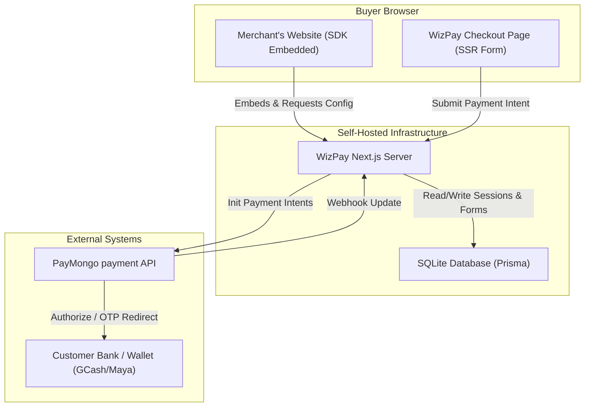
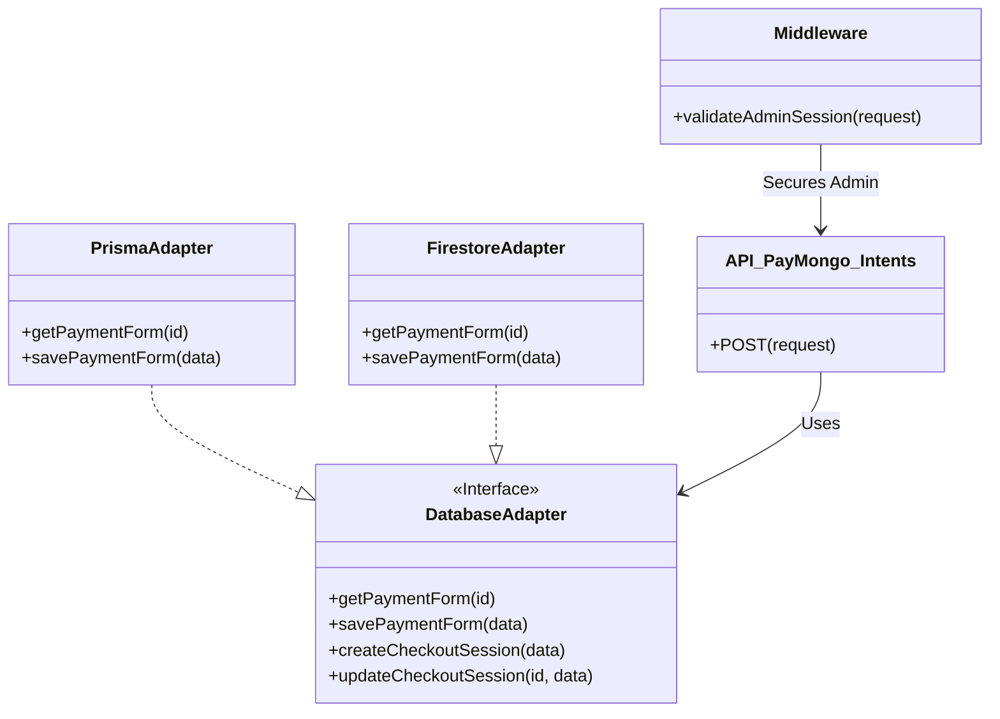
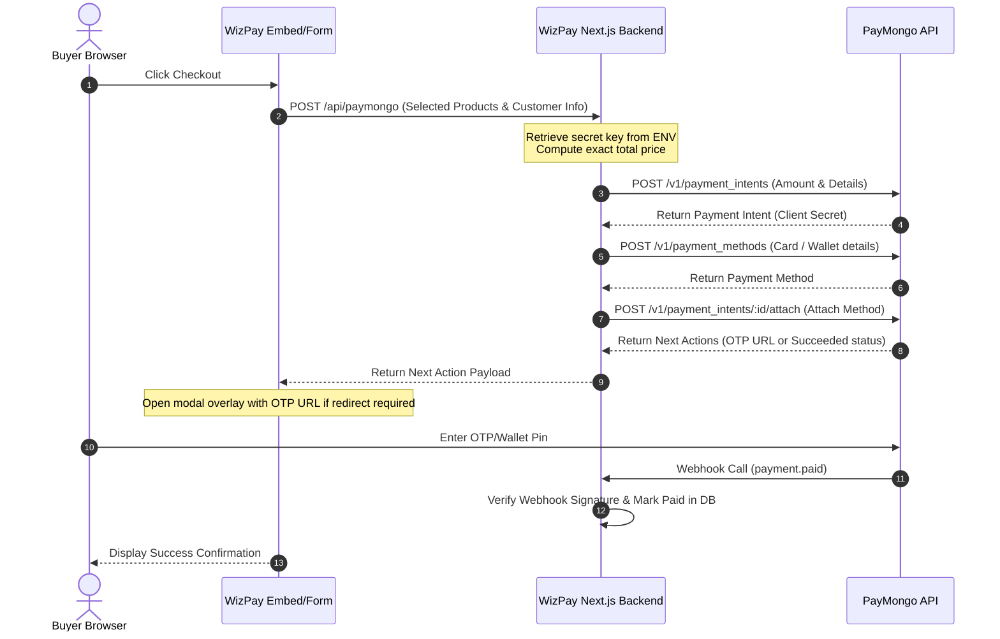

# WizPay Architecture Documentation (arc42 Template)

This document describes the architecture of WizPay, an independent, self-hosted checkout engine and storefront orchestration framework.

---

## 1. Introduction and Goals

WizPay is an open-source, self-hosted payment checkout platform designed for Philippine merchants. It allows MSMEs to deploy a private payment engine that integrates with PayMongo, supporting local methods (GCash, Maya, GrabPay, cards, and QR Ph) with zero platform commission fees.

### 1.1 Quality Goals
1.  **Security**: Strict isolation of gateway API credentials and signature verification for all payment callbacks.
2.  **Performance (Mobile Conversion)**: Server-side pre-rendered forms, minimal page weight, and immediate visual responsiveness under slow cellular networks (3G/4G).
3.  **Deployability**: Simple, single-command local setup using a file-based SQLite database with zero cloud dependencies.

### 1.2 Stakeholders
*   **Merchants**: Want a reliable, fee-free payment portal and simple product management.
*   **Developers/Integrators**: Want an easily deployable wrapper around PayMongo with custom script embeds and robust APIs.

---

## 2. Architecture Constraints

*   **Runtime Environment**: Node.js (v18+) Serverless or long-running instances.
*   **Framework**: Next.js 16 (App Router), React 18.
*   **Database Providers**: SQLite (default local file), Postgres, or Firebase Firestore (optional pluggable).
*   **Payment Gateway**: PayMongo API.

---

## 3. System Scope and Context

WizPay operates as a secure intermediary between the merchant's public website, the buyer's browser, and the PayMongo gateway.



---

## 4. Solution Strategy

1.  **Decoupled Storefront Embeds**: Keep the client SDK script lightweight (`/public/sdk/wizpay.js`) and let it query the Next.js server for sanitized JSON configurations to render products dynamically.
2.  **Database Abstraction**: Implement a Repository Adapter to support Prisma (SQLite/Postgres) and Firestore, allowing deployment flexibility.
3.  **Direct Intents Execution**: Avoid external redirects to PayMongo's site by collecting payment methods natively and utilizing PayMongo Payment Intents.

---

## 5. Building Block View

### 5.1 Directory Layout Reference
The codebase follows a modular structure for supporting pluggable databases:
```
packages/web-app/
  ├── prisma/
  │     └── schema.prisma        # SQLite / SQL Schema definitions
  ├── src/
  │     ├── app/
  │     │     ├── admin/         # Admin dashboard (Forms manager, developer keys)
  │     │     ├── api/
  │     │     │     ├── paymongo/# Payment Intent creation & attachment endpoints
  │     │     │     └── webhook/ # PayMongo background webhook receiver (Paid updates)
  │     │     └── payment-form/  # Public checkouts (Pre-rendered SSR page)
  │     ├── lib/
  │     │     ├── db.ts          # Unified database repository router
  │     │     ├── prisma.ts      # Prisma client instantiator
  │     │     └── adapters/      # Pluggable repository adapters
  │     │           ├── prismaAdapter.ts
  │     │           └── firestoreAdapter.ts
  │     └── utils/
  │           └── crypto.ts      # Security & encryption utilities (HMAC signature check)
```



---

## 6. Runtime View

### 6.1 Interactive Checkout Flow (Payment Intent Authorization)



---

## 7. Crosscutting Concepts

### 7.1 Security & Key Management
*   **Server Env Key Isolation**: Payment gateway credentials are never written to any database. They are only loaded on the server side via environment variables.
*   **Webhook Signature Validation**: The server computes a HMAC signature on incoming webhooks to verify origin authenticity.
    
    ```typescript
    import crypto from 'crypto';

    export function verifyPaymongoSignature(
        signatureHeader: string,
        rawBody: string,
        webhookSecret: string
    ): boolean {
        const [tField, v1Field] = signatureHeader.split(',');
        const timestamp = tField.split('=')[1];
        const signature = v1Field.split('=')[1];

        const payload = `${timestamp}.${rawBody}`;
        const computedSignature = crypto
            .createHmac('sha256', webhookSecret)
            .update(payload)
            .digest('hex');

        return computedSignature === signature;
    }
    ```

### 7.2 Performance and Layout
*   **RSC Pre-rendering**: Checkout forms pre-load database entities in Next.js Server Components, rendering final HTML with theme CSS variables without running loading spinners on the client.


---

## 8. Architecture Decisions

For detailed records of specific architectural choices, trade-offs, and consequences, see [adr.md](file:///c:/Users/ASUS/Documents/VSCode/oz_tech/agent_docs/adr.md).
