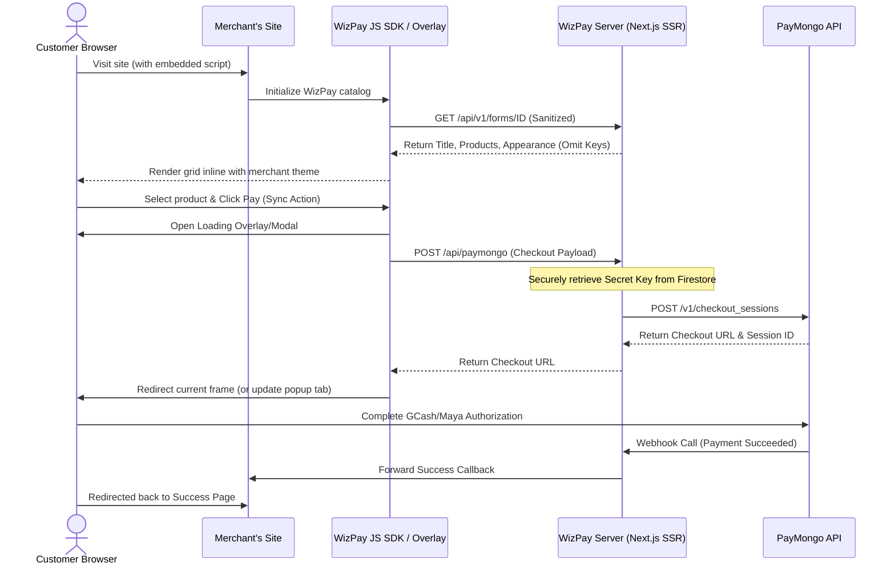

# WizPay: Sovereign Unified Checkout for Philippine MSMEs
*A Strategic Blueprint for Open-Access Local Payments and Storefront Orchestration*

---

## 1. Executive Summary
WizPay is an open-source, sovereign payment engine and storefront orchestration framework. Our core mission is the unconditional democratization of online transactions for Philippine merchants.

WizPay is structured in two distinct phases:
1. **Phase 1 (Current - Scenario B): Centralized Hosted SaaS.** We host the core database, APIs, and dashboard. Merchants sign up and input their own PayMongo API credentials. Transactions are routed securely through our centralized Next.js/Firebase infrastructure directly to their primary accounts.
2. **Phase 2 (End Goal - Scenario A): Sovereign Self-Hostable Engine.** WizPay will transition to a fully decoupled, open-source model where merchants deploy their own independent instances of the database and servers, achieving complete data sovereignty.

WizPay serves a dual-pathway architecture:
1. **For Non-Technical Merchants:** A codeless dashboard enabling the visual composition of secure checkout forms and copy-paste embedding scripts.
2. **For Software Engineers & Agencies:** A lightweight Embeddable SDK and a secure, sanitized REST API that acts as a secure backend gateway wrapper.

---

## 2. Core Pillars of the Platform

* **Progressive Checkout Overlay:** A modern checkout UX. Instead of redirecting buyers away from the merchant's site, a secure checkout modal slides open inline. The user completes payment authorizations (GCash OTP, Maya authorization) and slides closed seamlessly.
* **Sovereign Data Custody:** Direct gateway routing. Merchant credentials and transactions are stored securely in their own Firebase instance, completely removing third-party fees, clearing periods, and intermediate accounting risks.
* **Codeless Embed Builder:** A web configuration panel that auto-generates clean Javascript embed scripts (`<script src=".../sdk/wizpay.js">`) and inline responsive `<iframe>` code blocks.

---

## 3. Technology & UX Audit: Obsolete Paradigms in the Codebase

Evaluating the legacy codebase reveals several architectural patterns and UX details that are obsolete or sub-optimal for a modern, high-converting FinTech app:

### 3.1 UX Audit: The Async Pop-up Blocker Bug (Critical)
* **The Obsolete Flow:** In `page.tsx` (`handleSubmit`), clicking "Proceed to Payment" triggers an asynchronous `fetch` call to the server API to create a PayMongo checkout session. Once the response returns, the code calls `window.open(checkoutURL, '_blank')`.
* **The UX Issue:** Modern browsers (Safari, Chrome, iOS Safari) strictly block any `window.open` calls that occur inside asynchronous callbacks because they are not recognized as direct, synchronous user gestures. As a result, the payment tab is silently blocked, leaving the customer stuck on the form.
* **Modern Recommendation:** 
  1. Redirect the user in the same window using `window.location.href = checkoutURL`, or
  2. If a popup is absolutely required, open the new tab *synchronously* immediately upon clicking the button (showing a loading spinner), and then update that tab's URL once the asynchronous fetch completes.

### 3.2 Architectural Audit: Client Firebase SDK in Server Routes
* **The Obsolete Flow:** Server-side Next.js API routes (such as `/api/payment-forms/query`) fetch data using the client-side Firebase library imports (`getDoc`, `getDocs`, `query`, `where` from `firebase/firestore`) initialized in `src/firebase/config.ts`.
* **The Architectural Issue:** Running the client-side Firebase SDK in a Node serverless function environment is inefficient, leads to connection pooling overhead, slow cold starts, and bypasses the robust permissions of the Firebase Admin SDK.
* **Modern Recommendation:** Refactor all API routes to query Firestore exclusively via the Firebase Admin SDK (`firebase-admin`), which is optimized for server environments and matches the setup in `src/firebase/adminConfig.ts`.

### 3.3 Performance Audit: Client-Side Hydration Delay (Loading Spinners)
* **The Obsolete Flow:** The checkout page `/payment-form/[paymentFormId]` renders a full-screen loading spinner while it fetches form metadata from the client side via `fetchData` in a `useEffect`.
* **The Performance Issue:** This causes a layout shift and a 1–2 second delay for customers, hurting conversion rates.
* **Modern Recommendation:** Since Next.js uses server components, the checkout page should fetch form data server-side (SSR) during the initial request. The page will render instantly with the correct products and styles, eliminating loading spinners entirely.

### 3.4 Integration Audit: Outdated PayMongo Gateways
* **The Obsolete Flow:** The PayMongo integration routes request deprecated payment method types such as `paymaya` (rebranded to `maya`) and direct bank codes that are now consolidated under standard QR Ph protocols.
* **Modern Recommendation:** Streamline the gateway payload to request standard QR Ph, GCash, Maya, cards, and Billease.

---

## 4. The Modernized Transaction Architecture



---

## 5. Go-to-Market & Integration Code Specs

### A. Non-Technical Copy-Paste Embed
```html
<div id="wizpay-storefront" data-form-id="PAYMENT_FORM_ID"></div>
<script src="https://yourdomain.com/sdk/wizpay.js"></script>
```

### B. Technical Developer API
Developers can query the sanitized endpoint to build headless storefronts:
`GET /api/v1/forms/[paymentFormId]`

```json
{
  "paymentFormTitle": "PH Artisans Shop",
  "paymentFormProducts": [
    {
      "productName": "Handcrafted Wallet",
      "productPrice": 750.00,
      "productDescription": "Genuine local leather"
    }
  ],
  "appearance": {
    "colorScheme": "emerald",
    "fontFamily": "nunito"
  }
}
```

---

## 6. Future Roadmap

* **PH-Context Logistics Engine:** Pre-built validation rules mapping Philippine geography (Provinces, Cities, and Barangays) to calculate localized flat-rate or regional shipping fees automatically.
